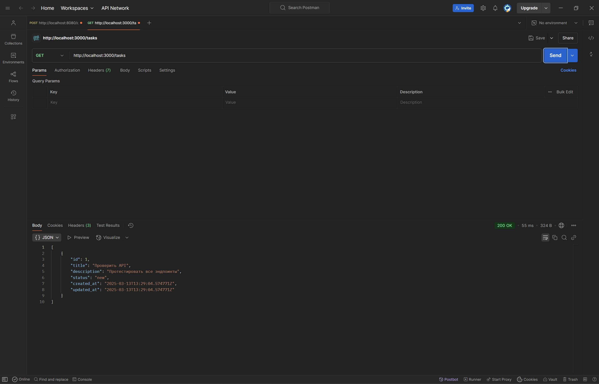
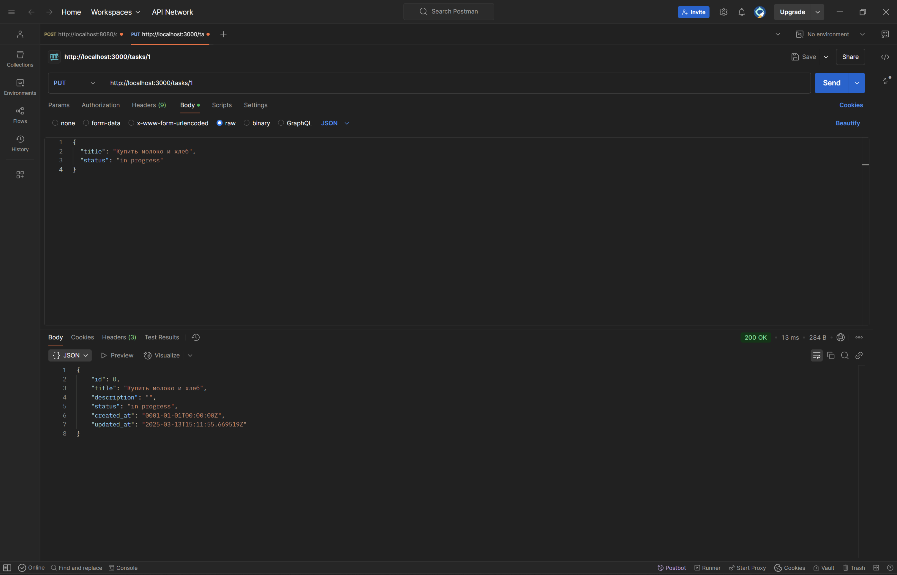
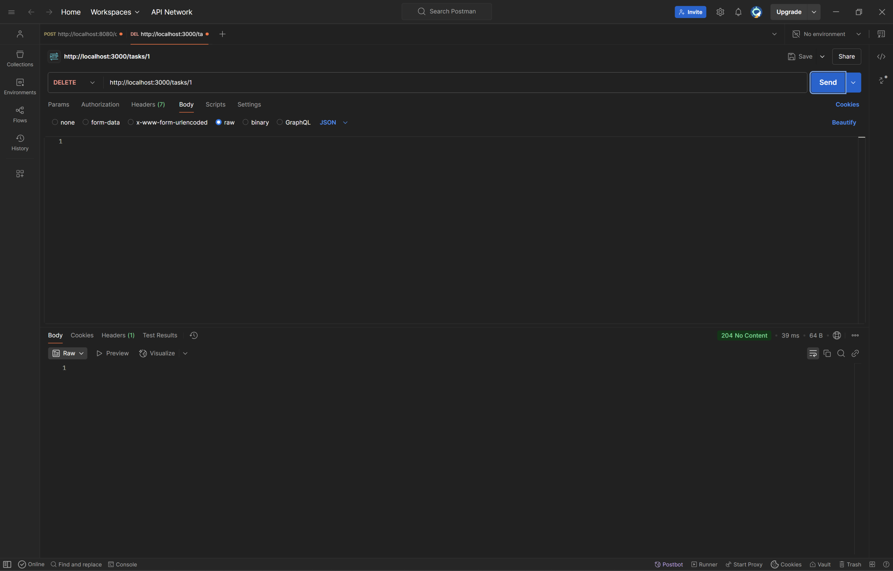

# TODO List REST API

REST API для управления задачами, разработанное на Go с использованием Fiber и PostgreSQL.

## Запуск через Docker
1. Склонируйте репозиторий:
   ```bash
   git clone https://github.com/FolderWithFolders/todo-api.git
   cd todo-api
2. Создайте .env как в репозитории
3. Запустите контейнер
   docker-compose up -d
## Для проверки БД в Docker
1. Подключитесь к контейнеру PostgreSQL:
   docker-compose exec db psql -U postgres -d todo
2. Проверьте существование таблицы tasks:
   \dt
3. Выполните запрос к таблице:
   SELECT * FROM tasks;

## Пример успешного выполнения:
todo-# \dt
          List of relations
Schema | Name  | Type  |  Owner
--------+-------+-------+----------
public | tasks | table | postgres
(1 row)

todo-# SELECT * FROM tasks;
 id |    title    | status |         created_at         |         updated_at
----+-------------+--------+----------------------------+----------------------------
  1 | Тестовая... | new    | 2023-10-10 12:00:00.000000 | 2023-10-10 12:00:00.000000
(1 row)

## API доступно на http://localhost:3000/tasks

## Примеры запросов
### Создание задачи (POST /tasks)

### Получение задач (GET /tasks)

### Изменение задач (PUT /tasks)

### Удаление задач (DELETE /tasks)
